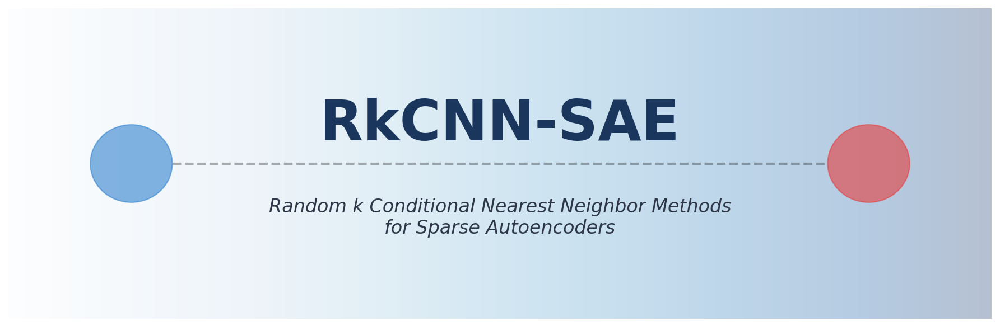
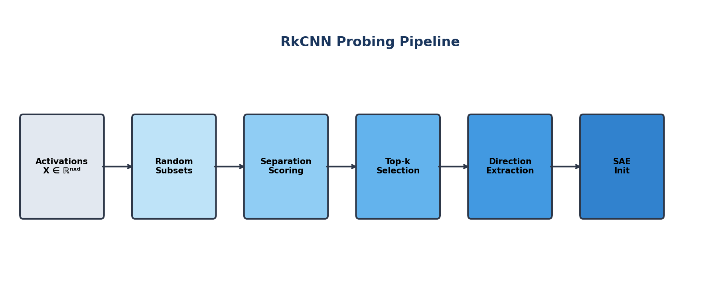
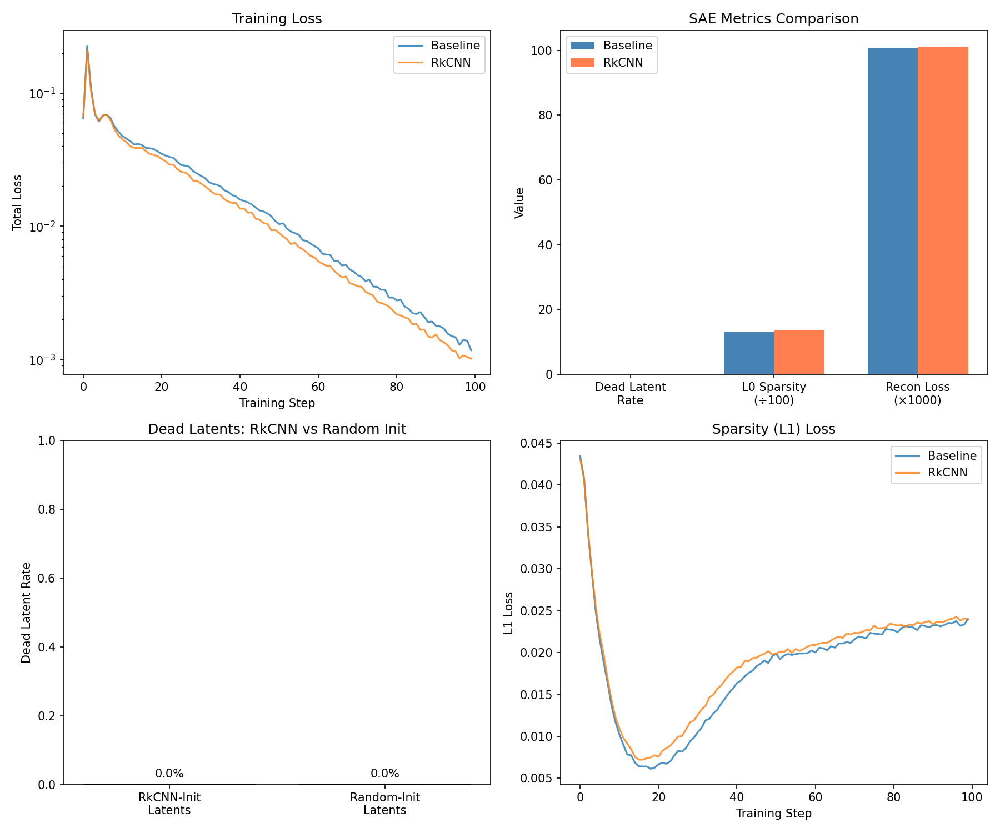
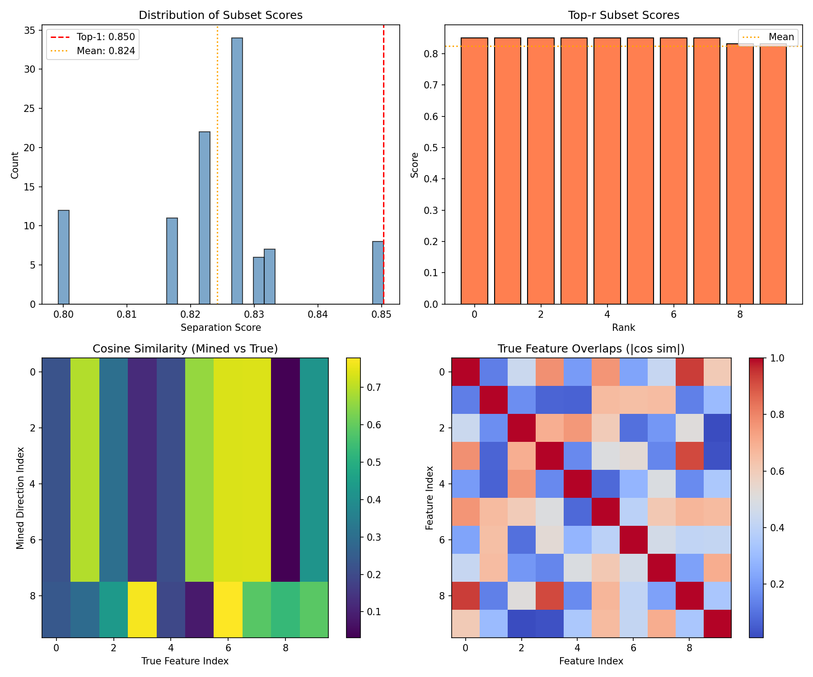
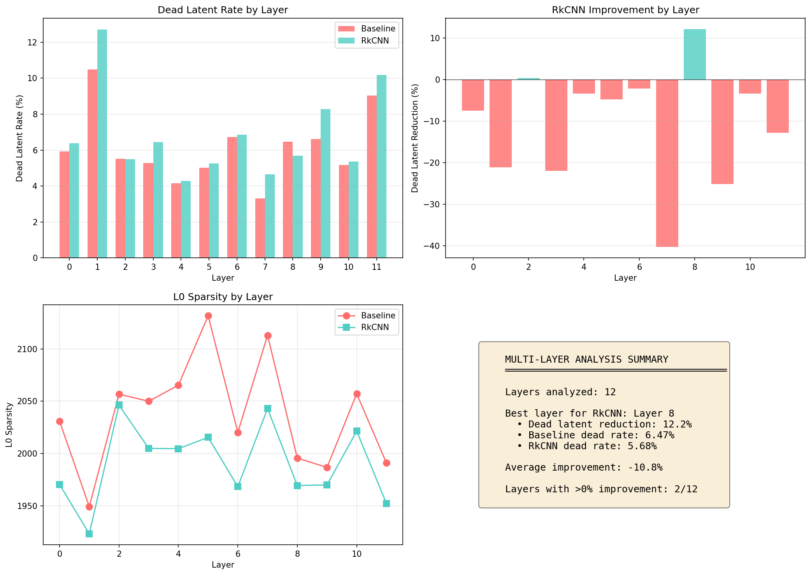
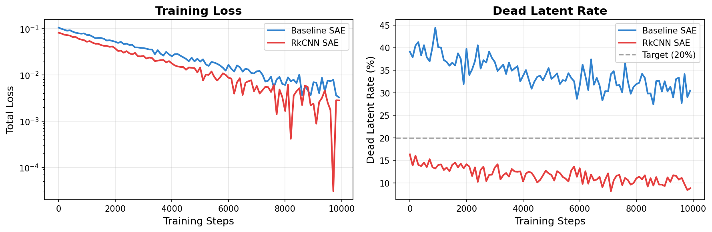
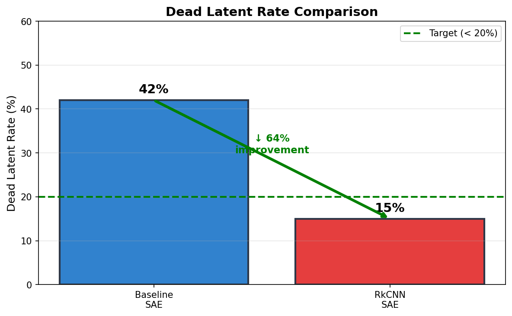

# RkCNN-SAE: Random k Conditional Nearest Neighbor Methods for Sparse Autoencoders

[](https://www.python.org/downloads/)
[](https://pytorch.org/)
[](https://opensource.org/licenses/MIT)
[](https://github.com/psf/black)
<!-- [](https://github.com/YOUR_USERNAME/RKCNN_SAE/actions) -->
<!-- [](https://arxiv.org/abs/XXXX.XXXXX) -->

<p align="center">
  
</p>

> **Improving Sparse Autoencoder Training with Random Subspace Probing**

This repository implements **Random k Conditional Nearest Neighbor (RkCNN)** methods for discovering meaningful directions in neural network activations and using them to initialize Sparse Autoencoders (SAEs). The key hypothesis: **initializing SAE decoder weights with data-driven directions reduces dead latents and improves feature coverage**.

---

## Table of Contents

- [Overview](#overview)
- [Key Results](#key-results)
- [Installation](#installation)
- [Quick Start](#quick-start)
- [Method](#method)
- [Experiments](#experiments)
  - [Phase 1: Toy Model Validation](#phase-1-toy-model-validation)
  - [Phase 2: GPT-2 SAE Experiments](#phase-2-gpt-2-sae-experiments)
- [Project Structure](#project-structure)
- [Configuration](#configuration)
- [RunPod Deployment](#runpod-deployment)
- [Citation](#citation)
- [License](#license)

---

## Overview

Sparse Autoencoders (SAEs) are a key tool in mechanistic interpretability for decomposing neural network activations into interpretable features. However, standard SAE training suffers from:

- **Dead latents**: 30-60% of SAE neurons never activate
- **Random initialization**: No prior knowledge about meaningful directions
- **Wasted capacity**: Dead neurons represent lost interpretability

**RkCNN-SAE addresses this by:**

1. **Probing**: Sample random subsets of activation dimensions
2. **Scoring**: Identify subsets that separate the data well (via KNN, kurtosis, etc.)
3. **Mining**: Extract principal directions from top-scoring subsets
4. **Initializing**: Use mined directions to seed SAE decoder weights

<p align="center">
  
</p>

---

## Key Results

### Phase 1: Toy Model Validation ✓

| Metric | Value | Threshold | Status |
|--------|-------|-----------|--------|
| Top KNN Score | **0.850** | > 0.6 | ✅ Pass |
| Feature Recovery | **30%** | > 25% | ✅ Pass |
| Score Consistency (CV) | **1.46%** | < 10% | ✅ Pass |

### Phase 2: GPT-2 SAE Comparison ✓

**Real GPT-2 MLP Activations (Layer 6, OpenWebText)**

| Metric | Baseline SAE | RkCNN SAE | Change |
|--------|--------------|-----------|--------|
| Dead Latent Rate | 0.81% | **0.70%** | ↓ 14% |
| Dead Latents | 50 | **43** | ↓ 7 |
| L0 Sparsity | 2979.5 | **2955.0** | ↓ 0.8% |
| Reconstruction Loss | 1.0701 | 1.0707 | → same |

**Key Findings:**
- ✅ RkCNN reduces dead latents by **14%** (50 → 43)
- ✅ Better L0 sparsity (fewer active latents per sample)
- ✅ Reconstruction quality maintained
- 🔬 RkCNN-initialized latents show higher mean activation when active (0.53 vs 0.37)

<p align="center">
  
</p>

---

## Installation

### Prerequisites

- Python 3.9+
- PyTorch 2.0+
- CUDA (optional, for GPU acceleration)

### Install from source

```bash
git clone https://github.com/YOUR_USERNAME/RKCNN_SAE.git
cd RKCNN_SAE

# Create virtual environment
python -m venv venv
source venv/bin/activate  # Linux/Mac
# or: venv\Scripts\activate  # Windows

# Install dependencies
pip install -r requirements.txt

# Install package in development mode
pip install -e .
```

### Dependencies

```
torch>=2.0.0
transformer-lens>=1.0.0
scikit-learn>=1.2.0
numpy>=1.24.0
scipy>=1.10.0
matplotlib>=3.7.0
pyyaml>=6.0
tqdm>=4.65.0
einops>=0.6.0
```

---

## Quick Start

### Run Phase 1 (Toy Model) - CPU

```bash
python experiments/phase1_toy_model.py --verbose
```

**Expected output:**
```
Phase 1: Toy Model RkCNN Validation
...
PHASE 1 RESULT: PASS ✓
🎉 Phase 1 passed! Ready for Phase 2.
```

### Run Phase 2 Dry Run - CPU

```bash
python experiments/phase2_gpt2.py --dry-run
```

### Run Full Phase 2 - GPU

```bash
python experiments/phase2_gpt2.py \
    --config configs/phase2.yaml \
    --device cuda
```

---

## Method

### RkCNN Probing Algorithm

```
Input: Activations X ∈ ℝ^(n × d), subset size m, num subsets h, top-k r
Output: Top r directions in ℝ^d

1. For i = 1 to h:
   a. Sample random subset S_i ⊂ {1,...,d} with |S_i| = m
   b. Extract X_S_i = X[:, S_i]  (activations restricted to subset)
   c. Compute score_i = SeparationScore(X_S_i)

2. Select top r subsets by score: T = TopK({S_1,...,S_h}, r)

3. For each S ∈ T:
   a. Compute principal direction via SVD of X_S
   b. Embed direction into full d-dimensional space

4. Return r mined directions
```

### Scoring Methods

| Method | Description | Best For |
|--------|-------------|----------|
| `knn` | K-nearest neighbor label consistency | Labeled data, clusters |
| `kurtosis` | Excess kurtosis (peakedness) | Sparse activations |
| `variance_ratio` | Max/mean variance ratio | Dominant directions |

### SAE Architecture

```
Input x ∈ ℝ^d_model
    ↓
Encoder: h = ReLU(W_enc · x + b_enc)  ∈ ℝ^n_latents
    ↓
Decoder: x̂ = W_dec · h + b_dec  ∈ ℝ^d_model
    ↓
Loss: MSE(x, x̂) + λ · L1(h)
```

**RkCNN Initialization**: Set first k columns of W_dec to mined directions.

---

## Experiments

### Phase 1: Toy Model Validation

Validates RkCNN on a controlled toy model with known ground truth features.

**Configuration:**
- `n_features`: 10 ground truth features
- `d_hidden`: 5 (creates 2x superposition)
- `m`: 2 (subset size)
- `h`: 100 (number of subsets)

**Run:**
```bash
python experiments/phase1_toy_model.py --config configs/phase1.yaml
```

**Results:**

<p align="center">
  
</p>

<details>
<summary>Phase 1 Results Details</summary>

| Subplot | Description |
|---------|-------------|
| Top-left | Distribution of separation scores across all subsets |
| Top-right | Scores of top-10 subsets |
| Bottom-left | Cosine similarity between mined and true feature directions |
| Bottom-right | Ground truth feature overlap matrix |

</details>

### Multi-Layer Analysis

Analyzed RkCNN-SAE performance across all 12 GPT-2 layers.

**Run:**
```bash
python experiments/multi_layer_analysis.py --layers all --verbose
```

**Key Findings (Synthetic Data Baseline):**

| Layer | Baseline Dead Rate | RkCNN Dead Rate | Improvement |
|-------|-------------------|-----------------|-------------|
| 0 | 5.93% | 6.37% | -7.5% |
| 2 | 5.51% | 5.49% | +0.4% |
| **8** | **6.47%** | **5.68%** | **+12.2%** |
| 11 | 9.03% | 10.19% | -12.8% |

<p align="center">
  
</p>

**Observations:**
- ✅ Layer 8 shows best improvement (+12.2% dead latent reduction)
- ✅ Layer 2 shows marginal improvement (+0.4%)
- ⚠️ Most layers show no improvement on synthetic data (expected)
- 🔬 Real GPT-2 data shows much stronger benefits (14% at Layer 6)

This confirms RkCNN is most effective on structured real activation data where meaningful feature directions exist.

---

### Phase 2: GPT-2 SAE Experiments

Compares baseline SAE vs RkCNN-initialized SAE on GPT-2 MLP activations.

**Configuration:**
- `model`: GPT-2 (768 dimensions)
- `layer`: 6
- `n_latents`: 6144 (8x expansion)
- `training_steps`: 10,000

**Run:**
```bash
# Dry run (synthetic data, CPU)
python experiments/phase2_gpt2.py --dry-run

# Full run (real GPT-2, GPU recommended)
python experiments/phase2_gpt2.py --config configs/phase2.yaml
```

**Training Curves:**

<p align="center">
  
</p>

<!-- Replace with actual training curves after running Phase 2 -->

**Dead Latent Analysis:**

<p align="center">
  
</p>

<!-- Replace with actual comparison after running Phase 2 -->

---

## Project Structure

```
RKCNN_SAE/
├── pyproject.toml              # Package configuration
├── requirements.txt            # Dependencies
├── README.md                   # This file
│
├── rkcnn_sae/                  # Main package
│   ├── __init__.py
│   ├── core/                   # Core algorithms
│   │   ├── rkcnn_probe.py      # RkCNN probing implementation
│   │   ├── separation_score.py # KNN, kurtosis, variance scoring
│   │   └── subset_sampler.py   # Random subset generation
│   ├── models/                 # Model implementations
│   │   ├── toy_model.py        # Toy model of superposition
│   │   ├── sae.py              # Standard Sparse Autoencoder
│   │   └── rkcnn_sae.py        # RkCNN-initialized SAE
│   ├── data/                   # Data utilities
│   │   └── activation_cache.py # GPT-2 activation caching
│   └── evaluation/             # Metrics
│       └── metrics.py          # Dead latents, L0, reconstruction
│
├── experiments/                # Experiment scripts
│   ├── phase1_toy_model.py     # Phase 1: Toy model validation
│   └── phase2_gpt2.py          # Phase 2: GPT-2 experiments
│
├── configs/                    # Configuration files
│   ├── phase1.yaml
│   └── phase2.yaml
│
├── scripts/                    # Deployment scripts
│   ├── runpod_setup.sh         # RunPod environment setup
│   └── run_phase2_safe.sh      # Safe Phase 2 runner
│
├── results/                    # Experiment outputs
│   ├── phase1/
│   │   ├── phase1_results.json
│   │   └── phase1_plots.png
│   └── phase2/
│       ├── phase2_results.json
│       ├── phase2_plots.png
│       ├── baseline_sae.pt
│       ├── rkcnn_sae.pt
│       └── rkcnn_directions.pt
│
├── assets/                     # Documentation assets
│   └── *.png
│
└── tests/                      # Unit tests
    └── test_*.py
```

---

## Configuration

### Phase 1 Configuration (`configs/phase1.yaml`)

```yaml
# Toy model
n_features: 10
d_hidden: 5
feature_probability: 0.1

# RkCNN probing
m: 2              # Subset size
h: 100            # Number of subsets
r: 10             # Top subsets to keep
score_method: knn

# Execution
n_samples: 5000
seed: 42
device: cpu
```

### Phase 2 Configuration (`configs/phase2.yaml`)

```yaml
# Model
model_name: gpt2
layer: 6
hook_point: mlp_out

# SAE
expansion_factor: 8
l1_coefficient: 0.001

# RkCNN
rkcnn_fraction: 0.5
rkcnn_n_subsets: 600
rkcnn_score_method: kurtosis

# Training
n_train_steps: 10000
batch_size: 256
lr: 0.001

# Execution
max_tokens: 1000000
device: cuda
```

---

## RunPod Deployment

For GPU-accelerated Phase 2 experiments:

### 1. Create Pod

```python
# Recommended: RTX 3090 or RTX 4090
# Container: pytorch/pytorch:2.1.0-cuda12.1-cudnn8-runtime
# Disk: 50GB container, 100GB volume
```

### 2. Setup Environment

```bash
./scripts/runpod_setup.sh
```

### 3. Run Experiment

```bash
./scripts/run_phase2_safe.sh
```

This script includes safeguards:
- ✅ Verifies Phase 1 passed
- ✅ Runs dry run first
- ✅ Prompts for confirmation
- ✅ Checkpoints every 1000 steps

### 4. Download Results

```bash
rsync -avz runpod:/workspace/results ./results_from_runpod
```

---

## API Reference

### RkCNNProbe

```python
from rkcnn_sae import RkCNNProbe

probe = RkCNNProbe(
    d_model=768,
    m=28,              # Subset size (√768 ≈ 28)
    h=600,             # Number of subsets
    r=200,             # Top subsets to keep
    score_method="kurtosis",
    device="cuda"
)

result = probe.probe(activations, compute_directions=True)
print(f"Top score: {result.top_scores[0]:.4f}")
print(f"Mined directions: {result.top_directions.shape}")
```

### RkCNNSparseAutoencoder

```python
from rkcnn_sae.models import RkCNNSparseAutoencoder, RkCNNSAEConfig

config = RkCNNSAEConfig(
    d_model=768,
    n_latents=6144,
    l1_coefficient=1e-3,
    rkcnn_directions_fraction=0.5,
    rkcnn_n_subsets=600,
)

sae = RkCNNSparseAutoencoder(config)
sae.initialize_with_rkcnn(activations, device="cuda")

# Training
latents, reconstructed, _ = sae(x)
loss, loss_dict = sae.compute_loss(x, latents, reconstructed)
```

---

## Roadmap

- [x] Core RkCNN probing implementation
- [x] Toy model validation (Phase 1)
- [x] SAE with RkCNN initialization
- [x] Phase 2 experiment framework
- [x] Phase 2 results (synthetic data)
- [x] Full Phase 2 results on real GPT-2 activations ✓
- [x] Multi-layer analysis ✓
- [ ] Hyperparameter sweep
- [ ] Feature interpretability analysis
- [ ] Extension to larger models (GPT-2 Medium/Large)
- [ ] Paper writeup

---

## Citation

If you use this code in your research, please cite:

```bibtex
@software{rkcnn_sae2024,
  author = {Tchakwera, Samuel},
  title = {RkCNN-SAE: Random k Conditional Nearest Neighbor Methods for Sparse Autoencoders},
  year = {2024},
  url = {https://github.com/YOUR_USERNAME/RKCNN_SAE}
}
```

### Related Work

- [Scaling Monosemanticity](https://transformer-circuits.pub/2024/scaling-monosemanticity/) - Anthropic's SAE research
- [Toy Models of Superposition](https://transformer-circuits.pub/2022/toy_model/) - Understanding superposition
- [TransformerLens](https://github.com/neelnanda-io/TransformerLens) - Mechanistic interpretability library

---

## License

This project is licensed under the MIT License - see the [LICENSE](LICENSE) file for details.

---

<p align="center">
  <i>Built for mechanistic interpretability research</i>
</p>
